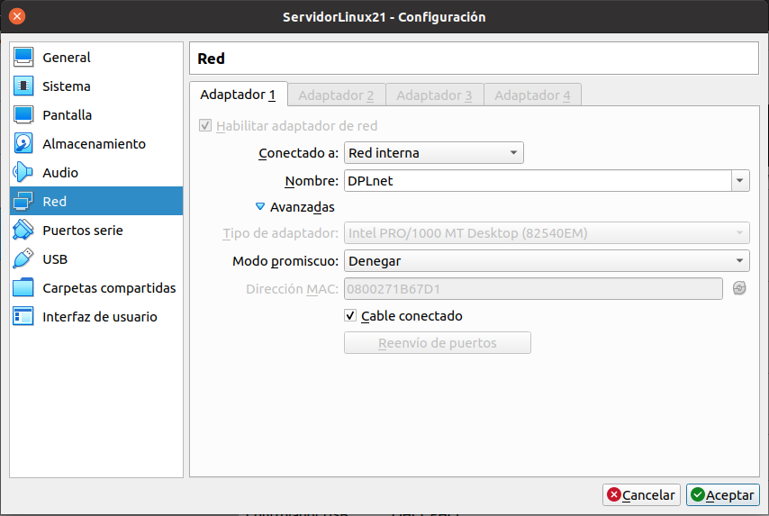
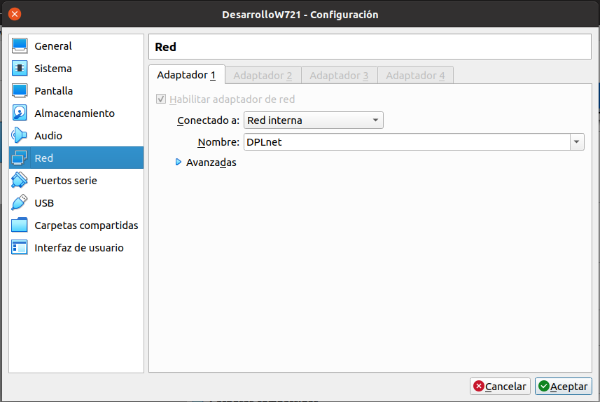
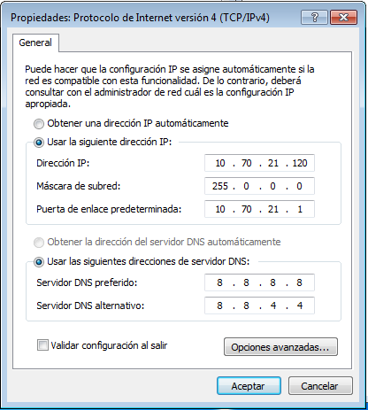
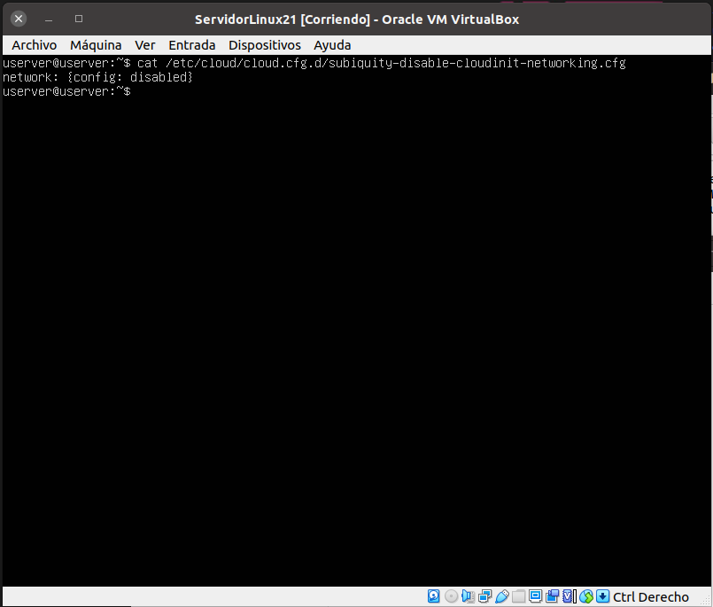
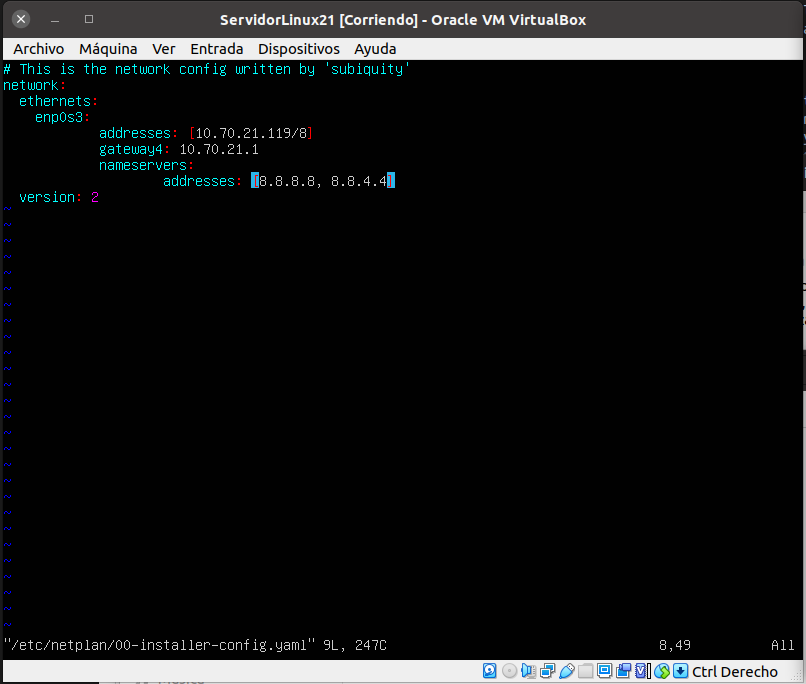
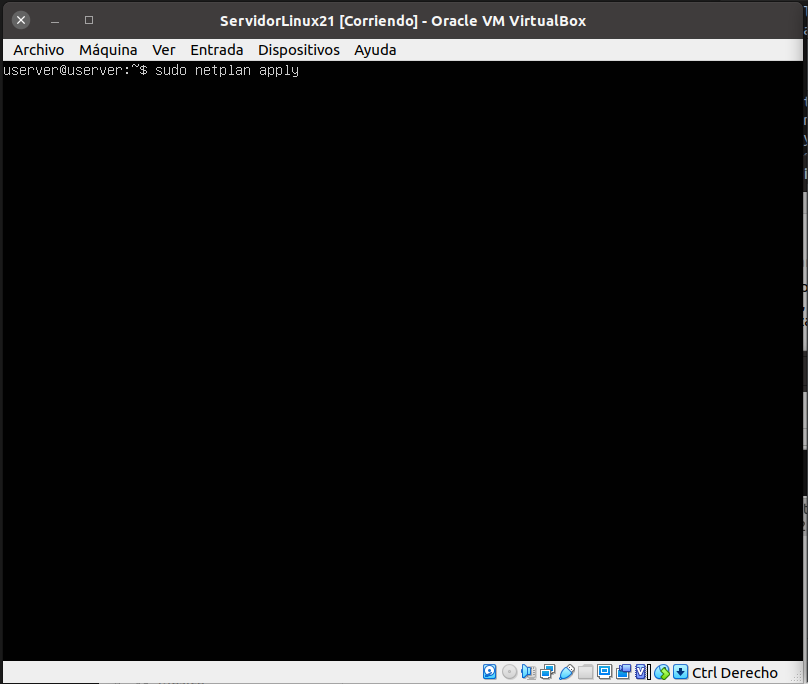
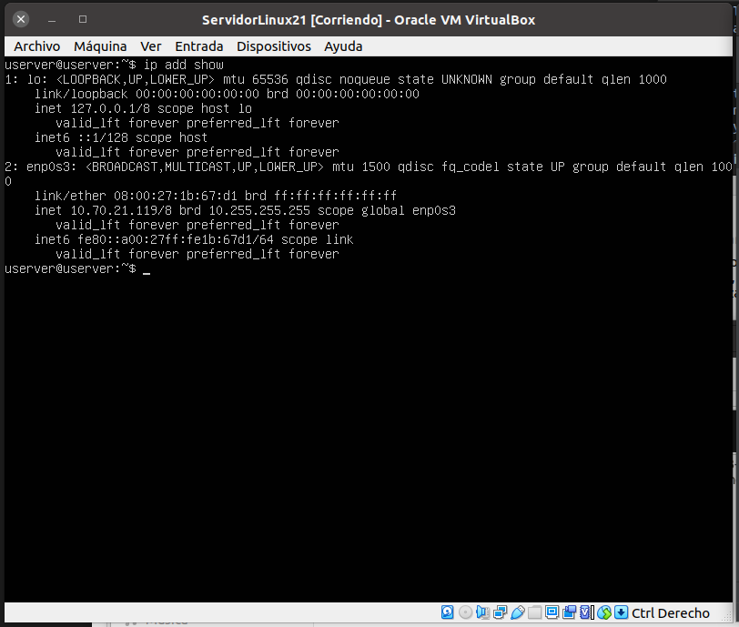
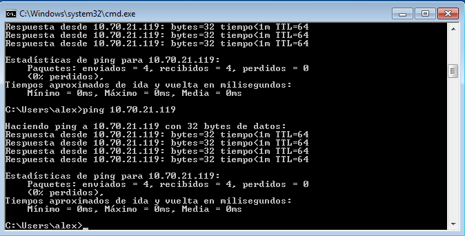
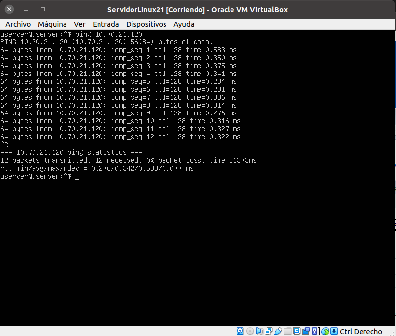

## 1. Configuracion del adaptador de red (maquina virtual)
como indica en la practica se esttablece una red interna con el nombre DPLnet

## 2. Configuración del adaptador de red en Windows 7.
Menu Inicio -> Panel de control -> Redes e Internet -> Centro de Redes y recursos compartidos -> Conexión de área local 
-> Propiedades -> Protocolo de Internet versión 4
se establece la ip 10.70.21.120 la máscara la cacula sola\

## 3. Configuración del adaptador de red en Ubuntu Server.
- compruebo si esta habilitada la confiuracion de cloud-init con este comando: cat /etc/cloud/cloud.cfg.d/subiquity-disable-cloudinit-networking.cfg

- accedo al archivo yaml de netplan: vim /etc/netplan/00-installer-config.yaml y establezco la siguiente configuracion

- la aplico con sudo netplan apply\

- compruebo que este todo bien configurado con ip add show\

## 4. Comprobación de la configuración y de funcionamiento.
- desde la máqiona windows hago pin a la maquina ubuntu con este resultado.
 

- desde la maquina ubuntu ejecuto png hacia la máquina windows

 